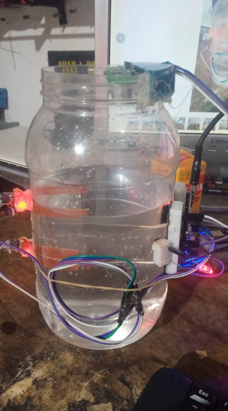

# Flood Notification App (Esp8266 Controller)
### esp8266 connected to 2 water level sensor and a ultrasonic sensor.
### if the water reach the first water level sensor then "warning",
### If reach second water level then danger and the water is measure by ultrasonic
### the value is send to node js server
### then it will be display to a flutter app.

